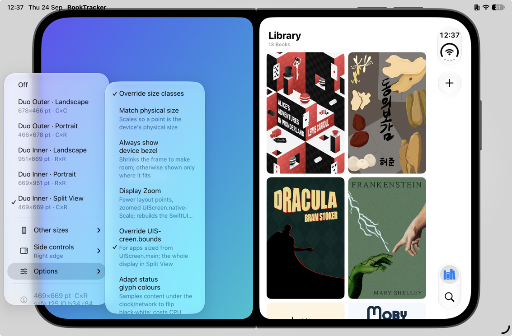

<h1 align="center">DuoFrameSimulator</h1>

<p align="center">
  Preview your app's layout at <b>iPhone Duo</b> display sizes on any device, without switching to the Duo simulator and Device Hub.
</p>

<p align="center">
  
  
  
</p>

<p align="center">
  
</p>

A drop-in Swift package that reframes your running app to a chosen iPhone Duo footprint: the real size, safe
area, size classes and corner shape the fold would report. It hosts your actual root view controller, so what
you see is your app laying out under Duo geometry, not a mockup. One call, no app-specific code, and it
compiles to nothing in release builds.

## Highlights

- **The Duo display poses** plus a shelf of released iPhone form factors and a custom size.
- **Faithful geometry** where it counts: size, safe-area insets, size classes, the phone idiom, `UIScreen.bounds`,
  and the real production resize path (frame changes fire the same trait and safe-area callbacks a live fold
  would).
- **Reframes the window, not the content**, so `.sheet`, `.fullScreenCover`, alerts and popovers land inside the
  footprint too.
- **Match physical size** and **Display Zoom** for the awkward edge cases.
- **Cosmetic Duo bars**: a Duo-style side strip with a fake Dynamic Island, a frosted clock-and-network pill and
  your app's real nav and tab items, rehomed and still interactive; in inner portrait, the pill in the top corner
  and a Duo-style bottom tab bar.
  Both stand in for the real bars whatever style the host device gave them.
- **Device bezel** redrawn from the Duo simulator's device art (rim, buttons, hinge spine, fold notches), shown
  wherever there's room around the frame, so on iPad; the frame is only shrunk to fit it if you ask.
- **Draggable menu button** that snaps to any edge, hidden by default and toggled with a shake gesture.

## Requirements

| | |
|---|---|
| Platform | iOS 17+ |
| Configuration | DEBUG only (empty module otherwise) |
| Best on | iPad (iPad mini ideal); works on any device |

Runs anywhere. On iPhone the larger Duo frames scale down to fit the screen, so you still get the layout, just
not at physical size. For a true-to-size preview run on an iPad, where the frame renders at 1:1 or better. The
iPad mini is the sweet spot: its density error errs pessimistic, so a marginal control that passes there passes
on the Duo. Running on an iPad host needs an iPad-capable build (`TARGETED_DEVICE_FAMILY = 1,2`); for live
host-window resizing, switch the iPad to **Windowed Apps** in Settings → Multitasking & Gestures.

## Installation

Add the package in Xcode (**File → Add Package Dependencies…**) using the URL, and link the `DuoFrameSimulator`
product to your app target:

```
https://github.com/appoly/iPhoneDuoFrameSimulator
```

Or in a `Package.swift`:

```swift
.package(url: "https://github.com/appoly/iPhoneDuoFrameSimulator", from: "1.0.0")
```

Then call `install()` once before the first window appears, under `#if DEBUG`:

```swift
#if DEBUG
import DuoFrameSimulator
#endif

// SwiftUI App.init(), or application(_:didFinishLaunchingWithOptions:)
#if DEBUG
DuoFrameSimulator.install()
#endif
```

That's the whole integration. Every app window's root is re-parented under the simulator; UIKit's own windows
(keyboard, alerts) are left alone.

<details>
<summary><b>Optional: rebuild on screen-metric changes</b></summary>

If your app sizes anything from `UIScreen.main` inside SwiftUI bodies, add the rebuild modifier to your
`WindowGroup`'s root content. Display Zoom and the bounds override then take effect without a relaunch, by giving
the tree a new identity so every `body` re-runs (navigation and `@State` reset, exactly as a real relaunch would):

```swift
WindowGroup {
    RootView()
        #if DEBUG
        .duoFrameRebuildOnScreenMetricsChange()
        #endif
}
```
</details>

> [!NOTE]
> The whole package is wrapped in `#if DEBUG`, so it compiles to an empty module in release builds. Xcode only
> builds a package in Debug for configurations whose name contains "Debug", so a custom config like "Staging" gets
> the empty module and won't compile the call sites. Keep them under your own `#if DEBUG`.

## Using it

The menu lives on a **floating button** that mirrors the iPad window controls. Drag it anywhere; it snaps to the
nearest edge and remembers where you left it. It's **hidden by default** and toggled with a **shake gesture**
(Device → Shake in the Simulator). Pass `install(showsButton: true)` to start visible.

### Poses

| Preset | Size (pt) | Size classes |
|---|---|---|
| Duo Outer · Landscape | 678 × 466 | Compact × Compact |
| Duo Outer · Portrait | 466 × 678 | Compact × Regular |
| Duo Inner · Landscape | 951 × 669 | Regular × Regular |
| Duo Inner · Portrait | 669 × 951 | Regular × Regular |
| Duo Inner · Split View | 469 × 669 | Compact × Regular |

An **Other sizes** submenu covers released iPhones (SE, mini, iPhone, XR, Plus, Pro, Pro Max) and a custom size,
as a general "other device" simulator. Those are plain phones: compact width, their own safe area, uniform
corners, no Duo side controls.

Every preset reports the `.phone` idiom through the trait collection, as the Duo does (`UIDevice.current` still
reports the host's). Every Duo pose replaces the real tab bar with a stand-in. Where the real bar shows (framing
off, or a regular-width custom size) on an iPad, it keeps the style it launched with, so a notice asks for a
relaunch while it's out of step.

### Options

| Option | Default | What it does |
|---|---|---|
| Override size classes | On | Reports the pose's size classes to `NavigationSplitView`, adaptive presentations and `horizontalSizeClass` checks |
| Match physical size | Off | Scales the frame so a point renders at the simulated device's real physical size |
| Always show device bezel | Off | Draws the bezel even where it wouldn't fit, shrinking the frame to make room; otherwise it only appears where it fits around the frame at the frame's own scale |
| Display Zoom | Off | Lays out at the device's zoomed point size and swizzles `UIScreen.nativeScale` to match |
| Override `UIScreen.bounds` | On | Reports the simulated display's size from `UIScreen.bounds` from launch, as the device would, so layout sized from `UIScreen.main` behaves as it will there; a Split View half reports the whole display. Framing off always reports the real screen |
| Adapt status glyph colours | Off | Samples the content under the clock and network glyphs to flip them black or white; re-renders the app content on each sample, so it carries a CPU cost |
| Show reserved regions | Off | Stripes the camera occlusion and fold keep-out zones as a guide, without changing the layout; the fold is a static marker since the simulator can't fold |

### Fit

The frame fits to the whole scene: the physical screen on iPhone, the window on iPad (so it follows Split View,
Stage Manager and live resizes). A frame the size of the scene renders at 1:1; a smaller one renders at true
point size, centred with a border; only a larger one scales below 1. So on a 17 Pro, iPhone Pro fills the screen,
iPhone SE is a bordered 1:1, and iPhone Pro Max scales down to fit. With **Always show device bezel** on, the
bezel counts as part of the device when fitting, so it also caps **Match physical size** wherever the device and
its bezel together won't fit at physical size.

Where the frame reaches the host's own insets, an iPhone host's hardware (Dynamic Island, corners) still pushes
the content clear. An iPad's status bar and home indicator are only software, so the frame keeps its own safe
area and those bars hide or fade while it overlaps them.

Settings persist in `UserDefaults`, so your last preset survives relaunches. They can also be forced at launch
with `-DuoFrameSimulator.settings <base64-json>` for scripted screenshots.

## How the framing works

<details>
<summary><b>Why the window, not the content</b></summary>

The obvious approach, transforming the app's view inside a full-screen container, works for the app itself but
not for `.sheet` / `.fullScreenCover` / alerts / popovers: UIKit presents those in a transition view attached to
the *window*, above the container, so they ignore the transform and fill the whole screen.

Framing the window instead puts every presentation inside the footprint. It does *not* change the window's scene, which
iOS exposes no API for (`GeometryPreferences.iOS` carries only orientation, `sizeRestrictions` only clamps a user
drag). Instead it sets the window's own `bounds`, `transform` and `center` within the scene.
</details>

<details>
<summary><b>Safe area</b></summary>

The framed window inherits little or none of the host's safe area (a sub-screen window usually reports zero), so
the hosted root is given `additionalSafeAreaInsets` equal to the faked Duo inset, clamped up to the host's real
overlap where the footprint still reaches a hardware region. There's no transform between the controller's view
and the window, so the child inherits the window's own insets normally.
</details>

<details>
<summary><b>Vertical bars, corners and the camera cutout</b></summary>

**Vertical bars.** With side controls on a pose, the strip draws a fake Dynamic Island, the clock and the
combined Wi-Fi/cellular glyph on a frosted pill (camera and status-cluster metrics measured on the 27.1 simulator;
the nav/tab item spacing is still from Apple's HIG screenshots), then the nav bar's items, then the tab bar's items
bottom-aligned, all on a column 48 pt in from the display edge. The buttons drive the real controllers, including
SwiftUI's native `TabView`, so tab switching genuinely selects. The navigation bar itself stays, as on the Duo:
only its items move to the strip, and a large title sits inline in the bar and disappears once scrolled. Every
pose puts the controls on a side edge except the inner display in portrait, the one HIG exception, which keeps
horizontal bars.

**Inner portrait.** The clock and network glyph sit side by side on their pill in the top trailing corner. The
real navigation bar stays; the tab bar is replaced by a floating pill of icon-over-title items with every tab
showing, sized and placed as measured on the 27.1 simulator (86 pt apart for up to three tabs, otherwise sharing
372 pt). It sits in the tab bar controller's own view, so sheets and covers stack over it, and it tops the
content's bottom safe area up to the bar's 83 pt band.

**Split-view companion.** The inner Split View half draws the *other* app as a gradient placeholder pane on the
opposite side, with a gutter between them. Each app keeps its controls on its outer edge, and both flip when you
change the edge.

**Corners.** Per-corner rounding matches the fixed physical device corners: the device exterior, a pane's seam
against the divider, and the outer display's hinge. Inner rounds all four equally; a split pane rounds full on
its outer corners and at the seam radius against the divider; outer portrait rounds the camera edge more than the
hinge opposite it.

**Camera cutout.** Fixed to the hardware and rotating with the device: top of the strip in outer portrait, and
following the rotation in outer landscape. The inner display's camera is under-display, so there's no cutout.

**Device bezel.** A backdrop window beneath the app draws a grey studio gradient (darker in Dark Mode), the
display's black glass, and a vector redraw of the 27.1 simulator's device art: the black border, the lit metal
rim, the buttons, and either the closed device's hinge spine or the open device's fold notches. Its metrics and
tones are measured off the simulator's frame, and it turns with the pose like the corners do. It only appears
when it fits around the frame at the frame's own scale, which in practice means iPad; otherwise only the glass
is drawn, unless **Always show device bezel** shrinks the frame to make room. Other device sizes get a plain
shell without buttons.
</details>

## What it can and can't fake

**Faithful:** pose sizes, safe-area insets, size classes, corner radii, `UIScreen.bounds`, the side strip's glyph
layout, and the production resize path (frame changes drive the same `traitCollectionDidChange` and
`viewSafeAreaInsetsDidChange` callbacks a real fold would). All measured on the iPhone Duo simulator (Xcode 27.1).

**Still estimated:** the Display Zoom factors. Display Zoom can't be exercised on the Duo simulator (the setting
isn't offered there), so these can only be confirmed on real hardware; the placeholders use the iPhone 17 Pro
factor until then.

**Not simulated:** the system keyboard is the host's, so it spans the host screen rather than the framed window.
